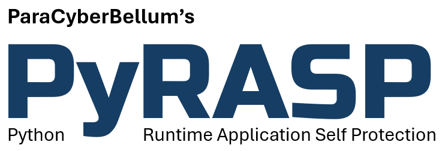

    
    
    

# What is PyRASP ?
`PyRASP` is a **Runtime Application Self Protection** package for Python-based Web Servers (Flask, FastAPI and Django) and Serverless Functions (AWS Lambda, Azure and Google Cloud Functions). It protects against the main attacks web applications are exposed to, from within the application. It is also capable of providing basic telemetry such as cpu and memory usage, as well as requests count. Additionally, `PyRASP` implements Zero-Trust Application Access for critical applications, ensuring only up-to-date authorized browsers can connect.

`PyRASP` also protects MCP servers tools from malicious inputs injections, and prevents data leaks (PII and credentials) that would result from unexpected processing.

It can operate using a local configuration file or get it from a remote/cloud server. Logs and telemetry (optional) can be sent to remote servers as well, and threats information can be shared across agents.

One specificity of `PyRASP` relies on the fact that it does not use signatures. Instead it will leverage decoys, thresholds, system and application internals as well as machine learning for detection.

> AWS Lambda Functions are no longer supported since version 0.8.3

# Documentation
[Full documentation](https://paracyberbellum.gitbook.io/pyrasp)
 [Release Notes](https://github.com/rbidou/pyrasp/blob/main/RELEASE-NOTES.md)
 [Web Site](https://pyrasp.paracyberbellum.io)

# Contacts
Renaud Bidou - renaud@paracyberbellum.io

